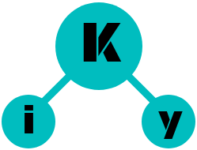

# iKy POC
The POC (Proof Of Concept) consists of collecting data based on an e-mail, format them and make a visual presentation. Such visualization was the one that interest people especially in areas related to the profiling.

## Motivation
This project was created as a POC (Proof Of Concept) for [#eko13](https://www.ekoparty.org). The interest of several people for this project excited us, so we release the code of the POC and create a new better project related.

## Screenshots

## Instalation
For the installation you must have python 2 and pip. The repository must be cloned :

```shell
git clone https://github.com/kennbroorg/iKy-POC.git
cd iKy-POC
git submodule init
git submodule update
```

The required libraries must be installed :

```shell
pip install -r requirements.txt
```

## Configuration
The Datasploit project needs the APIs configuration of the services to be used. For more information, refer to [How to Generate Api Keys](https://datasploit.readthedocs.io/en/latest/apiGeneration/).

Since the POC uses datasploit from pip, by executing the following command you can configure the APIs.

```shell
python src/datasploit/datasploit_config.py
```

The APIs (that need key) used in this POC are :
- FullContact
- GitHub
- Twitter
- MailBoxLayer

In any case, the program is validating them, reporting what is missing.

## Use
The project is simple. Run the httpData.py to wake up the server :

```shell
python httpData.py
```

The default parameters are :
* ip : 127.0.0.1
* port : 5500

But they can be changed :

```shell
python httpData.py -h
python httpData.py -i 127.0.0.1
python httpData.py -p 5500
python httpData.py -i 127.0.0.1 -p 5500
```

Once the server is executed, from the browser enter the ip:port chosen.

## Contributing
Not for this project. Soon we will release an improved project based on this and there you can contribute.

## License
This project is licensed under the MIT License - see the [LICENSE.md](LICENSE.md) file for details
